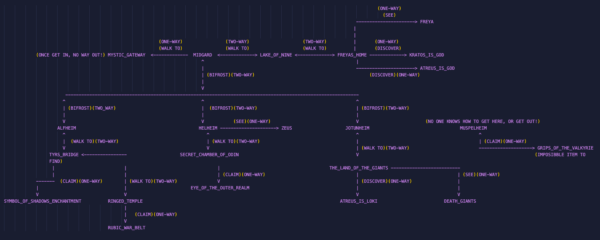

# PATH FINDING 

PLEASE LISTEN THIS WHEN REVIEWING -> [GOF4 Soundtrack](https://www.youtube.com/watch?v=rOmHpI0MMKE)
God Of War 4 traveling between realms and different locations in realms.
Each location has different items to be claimed, lands to be walked on, truths to be discovered and characters to be seen.

Realm names are considered as realms and the Bifrost. Bifrost is the "machine" that is used to travel between realms.
Each realm has different paths, items, discoveries and characters. It is possible to go from one point at a realm to another point at different realm if there is a path available.

Map below shows the connections between realms, locations, items, dicoveries and their relationships. 
You can't walk to KRATOS_IS_GOD, you can only discover it, and you can't discover or walk or bifrost from claims, discoveries and characters becasue they are (one-way)

Example: From MIDGARD you can either WALK TO LAKE_OF_NINE or BIFROST to [ALFHEIM, HELHEIM, JOTUNHEIM] or more 

* num of rules : 35
* WALK ANY DISTANCE ADVANCEDBIFROSTANDWALK()
* IF A AND B LOCATED AT DIFFERENT REALMS USE ADVANCEDBIFROSTANDWALK()
* IF CLAIM ITEMS USE BIFROSTANDWALKANDCLAIM()
* IF DISCOVER TRUTHS USE BIFROSTANDWALKANDDISCOVER()
* IF SEE CHARACTERS USE BIFROSTANDWALKANDSEECHARACTERS()

# TEST CASES
* Go from freyas_home To ringed_temple --> advancedbifrostandwalk(freyas_home, ringed_temple). Expected: True  Result: True
* Go from freyas_home To symbol_of_shadows_enchantment --> advancedbifrostandwalk(freyas_home, symbol_of_shadows_enchantment). Expected: False  Result: False, symbol_of_shadows_enchantment is an item and can only be claimed.
* Claim symbol_of_shadows_enchantment From the_land_of_the_giants --> bifrostandwalkandclaim(the_land_of_the_giants, symbol_of_shadows_enchantment). Expected: True  Result: True
* Discover kratos_is_god From ringed_temple --> bifrostandwalkanddiscover(ringed_temple, kratos_is_god). Expected: True  Result: True
* See zeus from death_giants --> bifrostandwalkandseecharacters(death_giants, zeus). Expected: False  Result: False  death_giants is a character to see and has no paths to anything.
* See zeus from freyas_home --> bifrostandwalkandseecharacters(freyas_home, zeus). Expected: True  Resul: True
* Go from secret_chamber_of_odin to muspelheim --> advancedbifrostandwalk(secret_chamber_of_odin, muspelheim). Expected: False  Result: False  No one knows how to get to muspelheim! NO ONE!

